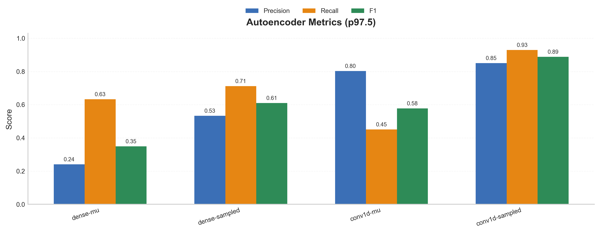
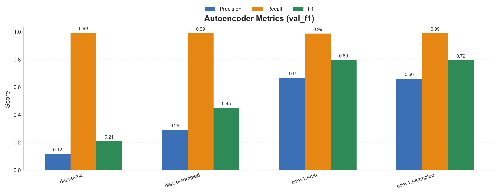
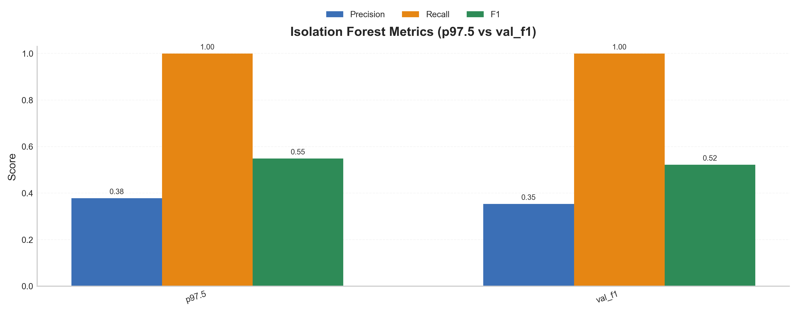
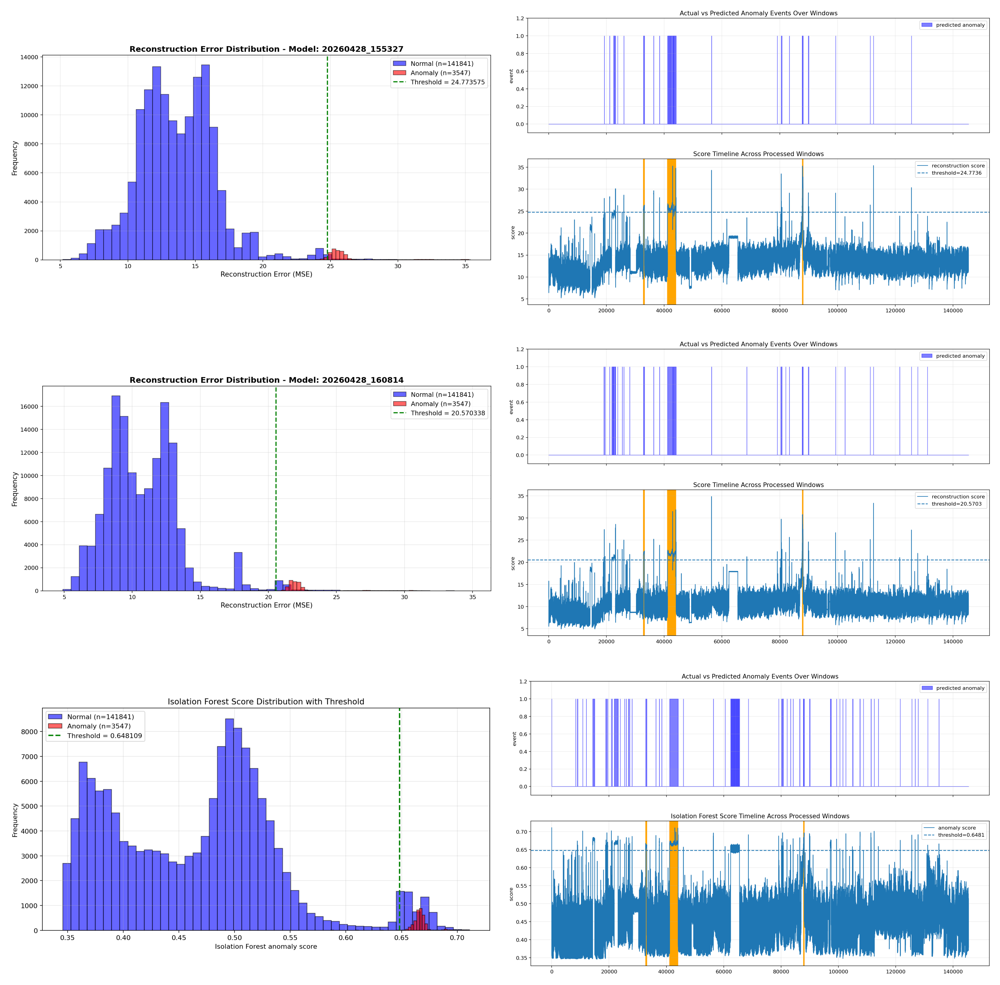

# metropt3-autoencoder-anomaly-detection

This project develops an anomaly detection system on the MetroPT3 air compressor dataset using a one-class autoencoder framework. The model is trained and evaluated on sequential windowed time series data, preserving the original class distribution without artificial rebalancing. The system learns normal operating behavior and identifies deviations as potential failures, achieving a strong F1 score of 0.888 under realistic evaluation settings.

---

## Dataset

MetroPT3 is an industrial sensor dataset collected from an air compressor system. It contains **1,516,948 rows**, **15 features**, along with timestamps and failure metadata used for labeling. The dataset is approximately **212.8 MB** in size.

### Problem: Extreme Class Imbalance

The data is highly imbalanced, with only **29,954 failure instances (~1.98%)** compared to over 1.48 million normal observations, making standard classification approaches difficult to apply reliably.

A common solution is **class rebalancing**, but this alters the true data distribution and often leads to results that do not generalize well. Another approach is to modify the loss function (e.g., weighted BCE or focal loss), but these methods still depend on labeled anomalies.

In contrast, this project adopts an **unsupervised one-class learning** approach. By focusing on learning normal behavior rather than relying on labeled failures, the model can detect deviations even when anomalous data is scarce, incomplete, or not yet observed. This makes the approach more aligned with practical deployment settings.

---

## Windowing Strategy

To incorporate temporal structure, the data is transformed into sliding windows. Each window has a size of **60 timesteps** with a **stride of 6**, corresponding to a 10-minute window with 1-minute intervals. A window is labeled as anomalous if the **last 10% of the window (6 datapoints)** contains anomalies. This design reduces false positives as a consistent presence of anomalous signals near the end of a window is required for it to be labeled as anomalous.

---

## Model

Autoencoders are trained to learn normal behaviors and detect anomalies via reconstruction error. Its **unsupervised nature** allows training without labeled anomalies, making it suitable for early-stage or rare-event detection. It is also versatile, as both the internal architecture and latent representation can be adapted or extended to other models.

The data is split sequentially to preserve temporal integrity:

* **2 months** for training (all normal data)
* **1 month** for validation (6.7% anomalous data)
* **4 months** for testing (2.5% anomalous data)

Key components and variations:

* **Architecture (Dense vs Conv1D)**

  Dense models process each window as a flattened vector, while Conv1D models process directly on sequences, which can help capture local temporal patterns.

* **Stochastic vs Deterministic Autoencoder**

  The model can be set to a **stochastic autoencoder** (with latent sampling), or a **deterministic autoencoder** (using the encoder mean `mu` directly)

* **Beta (KL weight)**

  A positive **beta** introduces a KL-divergence term, turning the model into a **variational autoencoder (VAE)**. Setting **beta = 0** (default) reduces it to a standard autoencoder objective.

* **Thresholding strategy**
  
  Anomaly decisions are based on reconstruction error using **p-train (97.5 percentile)** as a default, or **val_f1**, where the threshold is tuned on a validation set.

Training uses Adam (1e-3 learning rate), batch size of 1024, and gradient clipping for stability.

---

## Results

### Autoencoder metric comparisons





The autoencoder achieves strong performance, with results influenced by both architecture and threshold selection:
- Conv1D models generally outperform dense variants, indicating that capturing temporal structure within each window improves detection performance. 
- Stochastic autoencoder models perform well under a fixed 97.5 training percentile threshold, suggesting they are more effective at separating normal and anomalous data by consistently assigning higher reconstruction errors to anomalies.
- Using a validation set to tune the threshold (**val_f1**) yields almost perfect recall, but lacks precision.
- A fixed percentile threshold is not robust, as performance differs noticeably between Conv1D models with and without stochastic sampling under this setting. In contrast, both models achieve similar performance under val_f1-tuned thresholds. (**Note:** Threshold selection is independent of model training. Hence, for the same model, they have the same reconstruction error distribution, but with different thresholds for testing.)

### Isolation Forest metric comparison



Isolation Forest is included as an unsupervised one-class baseline and is applied on the same windowed data. It provides a fair reference as it does not rely on labeled anomalies and is widely used for anomaly detection. However, without explicitly modeling temporal structure, its performance remains below the Conv1D autoencoder models.

### Best-model comparison



This figure shows the reconstruction error distribution alongside the time series predictions, including normal and anomalous regions with their respective thresholds. From top to bottom, the plots correspond to:

- **Conv1D stochastic autoencoder**, best model with p-train 97.5 percentile threshold (F1 0.888)
- **Conv1D deterministic autoencoder**, best model with val_f1 threshold (F1 0.796)
- **Isolation forest baseline**, with p-train (97.5 percentile) threshold (F1 0.548)

From the time series plots, lower precision is reflected in a higher number of false positives. The 97.5 training percentile threshold produces fewer false positives in this experiment, but it relies on the assumption that most anomalous behavior lies in the upper tail (97.5–100 percentile) of the training reconstruction error distribution, which may not hold in practice and can therefore be unreliable. In contrast, calibrating the threshold using a validation set is generally more robust, even if it leads to a higher number of false positives.

---

## Takeaways

Maintaining the original class distribution leads to a more realistic evaluation of anomaly detection performance in highly imbalanced industrial data. Windowing plays a key role in reducing false positives by requiring consistent anomalous signals within a temporal context rather than reacting to isolated points.

The results also highlight that threshold selection is a critical factor. Fixed percentile thresholds are simple but can be unreliable, while validation-based calibration provides more stable performance across different model variants, despite introducing more false positives.

Finally, Conv1D architectures and stochastic variants consistently improve detection performance, suggesting that capturing temporal structure and probabilistic variation in reconstruction plays an important role in distinguishing normal and anomalous behavior.

## Reproducibility

The full pipeline can be reproduced by following these steps in order:

### 1. Environment Setup
Create a virtual environment and install dependencies:
```bash
python -m venv .venv
source .venv/bin/activate  # On Windows: .venv\Scripts\activate
pip install -r requirements.txt
```

### 2. Obtain Dataset
Download the MetroPT3 dataset from the [UCI ML Repository](https://archive.ics.uci.edu/dataset/791/metropt+3+dataset) and place the CSV file in `dataset/`. Expected: `dataset/MetroPT3(AirCompressor).csv` (~212.8 MB).

### 3. Data Preprocessing
Open and run `notebooks/preprocess_data.ipynb`. This generates:
- Labeled dataset → `dataset/preprocessed/labeled/`
- Sequential train/val/test splits → `dataset/preprocessed/splits/`
- Feature distribution plots → `dataset/preprocessed/plots/`

### 4. Windowing
Open `notebooks/window_data.ipynb`. Set `SPLIT_RUN_NAME` to match the folder created in step 3 (e.g., `20260428_111504`), then run the notebook. Output: `dataset/processed_windows/{timestamp}/` with train/val/test window arrays and metadata.

### 5. Training
Open `notebooks/train_models.ipynb` and configure:
- `architecture`: `"dense"` or `"conv1d"` 
- `sample_from_mu`: `True` or `False`
- `beta`: KL weight (default: 0.0)

Run the notebook to train and save models → `models/autoencoder/{timestamp}/`.

### 6. Evaluation
- Run `notebooks/evaluate_models.ipynb` to evaluate each model's metrics and plots on the test set.
- Run `notebooks/compare_models.ipynb` to obtain model comparison plots.

### Notes:
- All outputs are timestamped to avoid overwrites.
- `notebooks/train_models.ipynb` and `notebooks/evaluate_models.ipynb` refer to the latest processed window folder.
